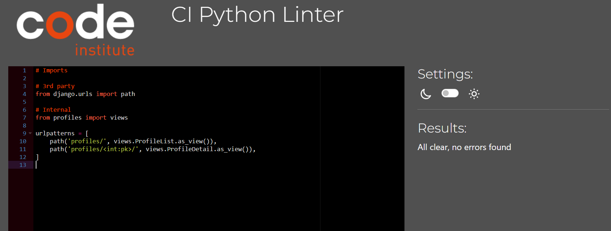
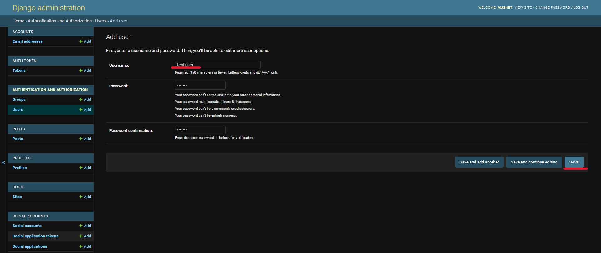
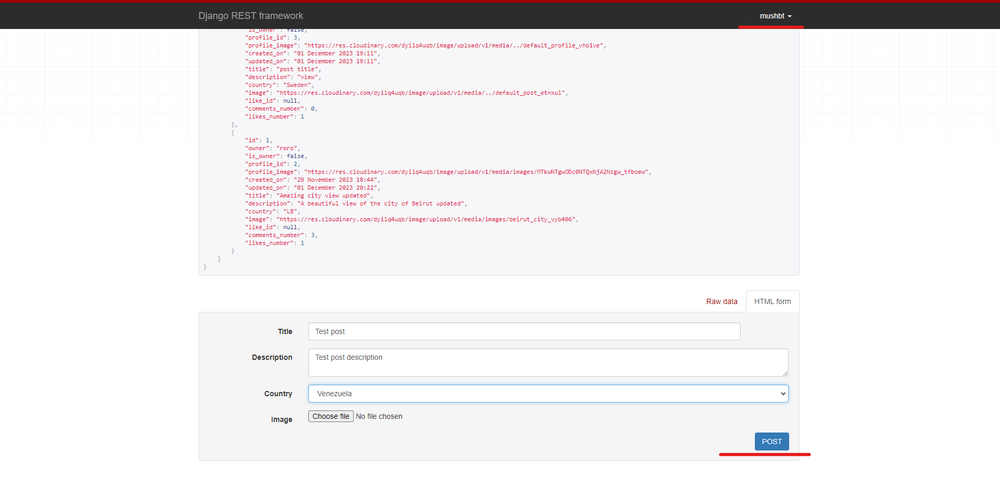
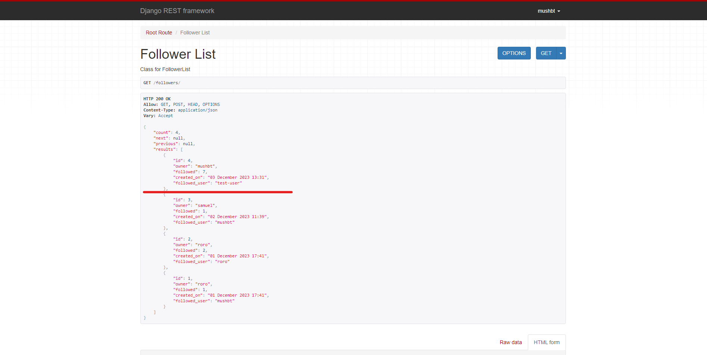
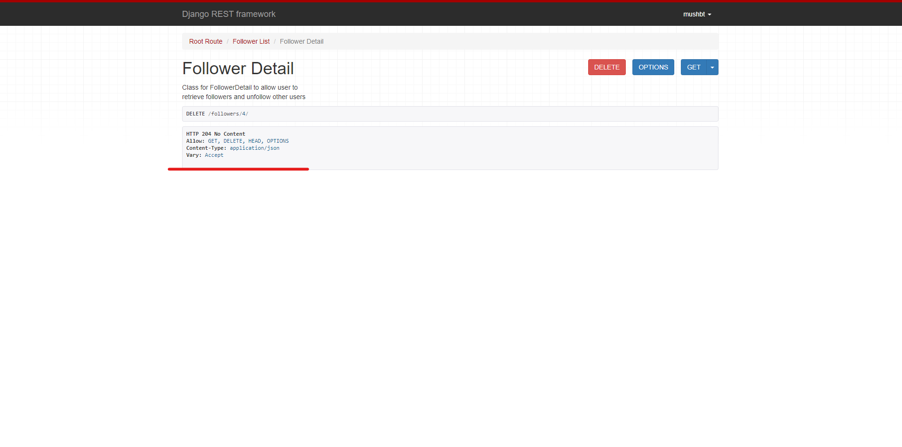

# TravelerViews API in DRF

**Developer: Mustafa Habet**

[Live link](https://traveler-view-90e3792ff7f0.herokuapp.com/)

This repository contains the API set up using Django REST Framework for the TravelerViews front-end application ([repostiory link](https://github.com/Mushbt/traveler_views_pp5) and [Live Link](https://traveler-views-pp5-aaa16a6f3832.herokuapp.com/)
<hr>

## Table of Contents
- [User Stories](#user-stories)
- [Database](#database)
- [Technologies Used](#technologies-used)
- [Validation](#validation)
- [Testing](#testing)
- [Deployment](#deployment)
- [Credits](#credits)
<hr>

## User Stories
The project's backend section centers on its administrative aspect and covers one user story:
- As an admin, I want to be able to create, edit and delete users, posts, comments and likes. This allows the admin to exercise control over the application's content and swiftly remove any inappropriate material.
<hr>

## Database

The following models were created to represent the database model structure of the application:

<hr>


#### User Model

- The User Model contains information about the user. It is part of the Django allauth library.
- One-to-one relation with the Profile model owner field.
- ForeignKey relation with the Follower model owner and followed fields.
- ForeignKey relation with the Post model owner field.
- ForeignKey relation with the Comment model owner field.
- ForeignKey relation with the Like model owner field.

#### Profile Model

- The Profile Model contains the following fields: owner, name, description, created_on, updated_on and image.
- One-to-one relation between the owner field and the User Model ID field.

#### Post Model

- The Post model contains the following fields: owner, created_on, updated_on, title, description, country and image.
- ForeignKey relation with the Comment Model post field.
- ForeignKey relation with the Like Model post field.

#### Follower Model

- The Follower Model contains the following fields: owner, followed and created_on.
- ForeignKey relation between the owner field and the User Model id field.
- ForeignKey relation between the followed field and the User Model post field.

#### Comment Model

- The Comment Model contains the following fields: owner, post, created_on, updated_on and content.
- ForeignKey relation between the owner field and the User Model ID field.
- ForeignKey relation between the post field and the User Model post field.

#### Like Model

- The Like Model contains the following fields: owner, post and created_on.
- ForeignKey relation between to the User Model ID field.
- ForeignKey relation between the owner field and the User Model ID field.
- ForeignKey relation between the post field and the Post Model post field.
<hr>

## Technologies Used

### Language & Frameworks

- Python
- Django

### Libraries & Tools

- [APITestCase](https://www.django-rest-framework.org/api-guide/testing/) - Django Rest Framework APITestCase was used for automated testing.
- [Cloudinary](https://cloudinary.com/) to store static files.
- [Dbdiagram.io](https://dbdiagram.io/home) used for the database schema diagram.
- [GitHub](https://github.com/) was used as a remote repository to store project code.
- [Gitpod)](https://gitpod.io/workspaces) - a virtual IDE workspace used to build this site.
- [Heroku](https://Heroku.com) was used to deploy the project into live environment.
- [Django REST Framework](https://www.django-rest-framework.org/) was used to build the back-end API.
- [Django AllAuth](https://django-allauth.readthedocs.io/en/latest/index.html) was used for user authentication.
- [Pillow](https://pillow.readthedocs.io/en/stable/) was used for image processing and validation.
- [Psycopg2](https://www.psycopg.org/docs/) was used as a PostgreSQL database adapter for Python.
- [ElephantSQL](https://www.elephantsql.com//) – This was used as the deployed project on Heroku uses an ElephantSQL database.
<hr>

## Validation

### PEP8 Validation
[PEP8CI](https://pep8ci.herokuapp.com/) Validation Service was used to check the code for PEP8 requirements. All the code passes with no errors or warnings.


<details><summary>DRF_API app</summary>
    <details><summary>Permissions</summary>
    
    </details>
    <details><summary>Serializers</summary>
    
    </details>
    <details><summary>Urls</summary>
    
    </details>
    <details><summary>Views</summary>
    
    </details>
</details>
<hr>
<details><summary>Comments app</summary>
    <details><summary>Models</summary>
    
    </details>
    <details><summary>Serializers</summary>
    
    </details>
    <details><summary>Tests</summary>
    
    </details>
    <details><summary>Urls</summary>
    
    </details>
    <details><summary>Views</summary>
    
    </details>
</details>
<hr>
<details><summary>Followers app</summary>
    <details><summary>Models</summary>
    
    </details>
    <details><summary>Serializers</summary>
    
    </details>
    <details><summary>Tests</summary>
    
    </details>
    <details><summary>Urls</summary>
    
    </details>
    <details><summary>Views</summary>
    
    </details>
</details>
<hr>
<details><summary>Likes app</summary>
    <details><summary>Models</summary>
    
    </details>
    <details><summary>Serializers</summary>
    
    </details>
    <details><summary>Tests</summary>
    
    </details>
    <details><summary>Urls</summary>
    
    </details>
    <details><summary>Views</summary>
    
    </details>
</details>
<hr>
<details><summary>Posts app</summary>
    <details><summary>Models</summary>
    
    </details>
    <details><summary>Serializers</summary>
    
    </details>
    <details><summary>Tests</summary>
    
    </details>
    <details><summary>Urls</summary>
    
    </details>
    <details><summary>Views</summary>
    
    </details>
</details>
<hr>
<details><summary>Profiles app</summary>
    <details><summary>Models</summary>
    
    </details>
    <details><summary>Serializers</summary>
    
    </details>
    <details><summary>Tests</summary>
    
    </details>
    <details><summary>Urls</summary>
    
    </details>
    <details><summary>Views</summary>
    
    </details>
</details>
<hr>

## Testing
The following tests were carried out on the app:
1. Manual testing
2. Automated testing

### Manual Testing

- As an admin, I want to be able to create, edit and delete users, posts, comments and likes. This allows the admin to exercise control over the application's content and swiftly remove any inappropriate material.

**Test** | **Action** | **Expected Result** | **Actual Result**
-------- | ------------------- | ------------------- | -----------------
User | Create, update & delete user | A user can be created, edited or deleted | Works as expected
User | Change permissions | User permissions can be updated | Works as expected
Profile | Create, update & delete | User profile can be created, edited or deleted | Works as expected
Post | Create, update & delete | A post can be created, edited or deleted | Works as expected
Comment | Create, update & delete | A comment can be created, edited or deleted | Works as expected
Like | Create & delete | A like can be created or deleted (like / unlike post) | Works as expected
Follower | Create & delete | Follow or unfollow user | Works as expected

In addition, posts, comments, likes and following can be created by logged-in users only. Users can only update or delete the content which was created by themselves.

<details><summary>User</summary>
    <details><summary>Create user</summary>
    
    
    
    </details>
    <details><summary>Change user permissions</summary>
    
    
    </details>
</details>
<hr>
<details><summary>Profile</summary>
    <details><summary>Update profile</summary>
    
    
    </details>
    <details><summary>Delete profile</summary>
    
    
    </details>
</details>
<hr>
<details><summary>Post</summary>
    <details><summary>Create post</summary>
    
    
    </details>
    <details><summary>Update post</summary>
    
    </details>
    <details><summary>Delete post</summary>
    
    
    </details>
</details>
<hr>
<details><summary>Comment</summary>
    <details><summary>Create comment</summary>
    
    
    </details>
    <details><summary>Update comment</summary>
    
    </details>
    <details><summary>Delete comment</summary>
    
    
    </details>
</details>
<hr>
<details><summary>Like</summary>
    <details><summary>Like post</summary>
    
    
    
    </details>
    <details><summary>Unlike post</summary>
    
    
    </details>
</details>
<hr>
<details><summary>Follow</summary>
    <details><summary>Follow user</summary>
    
    
    
    </details>
    <details><summary>Unfollow user</summary>
    
    
    </details>
</details>
<hr>

### Automated Testing

Even though automated testing was not required for this project, I decided to go ahead with it and I can say that it was a huge help! It helped me to discover a few errors in my code before I started to manually test all the different functions.

Automated testing was done using the Django Rest Framework APITestCase.

A total of 34 tests were created and they all passed.

<details><summary>Automated Testing</summary>

</details>


### The automated tests that were taken are as followed:

#### Comments Testing

- Test to ensure users can't create comments if not logged in.
- Test to ensure logged in users can create comments
- Test to ensure users can retrieve existing comments
- Test to ensure non existing comments can't be retrieved
- Test to ensure users can update their own comments
- Test to ensure user can't update other user's comments
- Test to ensure user can delete their own comments
- Test to ensure users can't delete other users comments

#### Followers Testing

- Test to ensure users who are not logged in can't follow other users
- Test to ensure logged in user can follow other users
- Test to ensure user can retrieve existing following using valid ID
- Test to ensure user can not retrieve a following from a non valid ID
- Test to ensure user can unfollow other users
- Test to ensure user can not remove other users followers

#### Likes Testing

- Test to ensure users who are not logged in not able to like posts
- Test to ensure logged in users can like posts
- Test to ensure user can retrieve existing likes using valid ID
- Test to ensure user can't retrieve likes with no valid ID
- Test to ensure user can unlike a post they have liked
- Test to ensure user can't remove other users likes

##### Posts Testing

- Test to ensure logged out users can't create posts
- Test to ensure logged in users can create posts
- Test to ensure all fields are filled before uploading post
- Test to ensure users can view posts
- Test to ensure existing posts can be retrieved
- Test to ensure non existing posts can't be retrieved
- Test to ensure user can delete their own posts
- Test to ensure users can't delete other users posts

#### Profiles Testing

- Test to ensure user can view other user profiles
- Test to ensure user can not view non existing profiles
- Test to ensure user can update their own profile
- Test to ensure user can't update other users profiles
- Test to ensure users can't update their profiles if not logged in
- Test to ensure user can delete their own profile
<hr>

## Deployment

### Creating the project:
1. Create the GitHub repository.
2. Create the project app on Heroku.
3. Add the Postgres package to the Heroku app.
4. Once the GitHub repository was launched on GitPod, installed the following packages in terminal with install command:
```
'django<4'
django-cloudinary-storage
Pillow
djangorestframework
django-filter
dj-rest-auth==2.1.9
'dj-rest-auth[with_social]'
djangorestframework-simplejwt
dj_database_url==0.5.0 psycopg2
gunicorn django-cors-headers
whitenoise
```

5. Created the Django project with the following command:
```
django-admin startproject project_name .
```

6. Back in Heroku, and under the Settings tab, added the following configvars:
    * Key: SECRET_KEY | Value: hidden
    * Key: CLOUDINARY_URL | Value: cloudinary://hidden
    * Key: DISABLE_COLLECTSTATIC | Value: 1
    * Key: ALLOWED_HOST | Value: drf-api-app-name.herokuapp.com

7. 0nce the ReactApp has been created added two additional configvars:
    * Key: CLIENT_ORIGIN | Value: https://react-app-name.herokuapp.com
    * Key: CLIENT_ORIGIN_DEV | Value: https://gitpod-browser-link.ws-eu54.gitpod.io
        * Check that the trailing slash "/" at the end of both links has been removed.
        * Gitpod occasionally updates the browser preview link. Tthe CLIENT_ORIGIN_DEV value then0 needs to be updated for development purposes.

8. Created the env.py file, and added the following variables. The value for DATABASE_URL was obtained from the Heroku configvars in the previous step:
```
import os`
os.environ['CLOUDINARY_URL'] = 'cloudinary://hidden'
os.environ['DATABASE_URL'] = 'postgres://hidden'
os.environ['SECRET_KEY'] = 'secret-key-of-mine'
os.environ['CLIENT_ORIGIN'] = 'https://8000-darkozlatar-djangorestf-hidden'
# os.environ['DEV'] = '1'
```

### Settings.py:

9.  Update INSTALLED_APPS by adding the following to support the newly installed packages:
```
'cloudinary_storage',
'django.contrib.staticfiles',
'cloudinary',
'rest_framework',
'django_filters',
'rest_framework.authtoken',
'dj_rest_auth',
'django.contrib.sites',
'allauth',
'allauth.account',
'allauth.socialaccount',
'dj_rest_auth.registration',
'corsheaders',
```

10. Import the database, the regular expression module & the env.py

```
from pathlib import Path
import os
import dj_database_url
import re
if os.path.exists('env.py'):
        import env
```

11. Below the import statements, add the following variable for Cloudinary and below INSTALLED_APPS, set site ID:

```
CLOUDINARY_STORAGE = {'CLOUDINARY_URL': os.environ.get('CLOUDINARY_URL')}
MEDIA_URL = '/media/'
DEFAULT_FILE_STORAGE = 'cloudinary_storage.storage.MediaCloudinaryStorage'
```

```
SITE_ID = 1
```

12. Below BASE_DIR, create the REST_FRAMEWORK, and include page pagination to improve app loading times, pagination count, and date/time format and set the default renderer to JSON::

```
REST_FRAMEWORK = {
    'DEFAULT_AUTHENTICATION_CLASSES': [(
        'rest_framework.authentication.SessionAuthentication'
        if 'DEV' in os.environ
        else 'dj_rest_auth.jwt_auth.JWTCookieAuthentication'
    )],
    'DEFAULT_PAGINATION_CLASS':
        'rest_framework.pagination.PageNumberPagination',
    'PAGE_SIZE': 10,
    'DATETIME_FORMAT': '%d %b %Y',
}
if 'DEV' not in os.environ:
    REST_FRAMEWORK['DEFAULT_RENDERER_CLASSES'] = [
        'rest_framework.renderers.JSONRenderer',
    ]
```

13. Then beneath that, added the following JWT code:
```
REST_USE_JWT = True
JWT_AUTH_SECURE = True
JWT_AUTH_COOKIE = 'my-app-auth'
JWT_AUTH_REFRESH_COOKIE = 'my-refresh-token'
JWT_AUTH_SAMESITE = 'None'
```

14. Underneath JWT tokens, added:
```
REST_AUTH_SERIALIZERS = {
    'USER_DETAILS_SERIALIZER': 'project-name.serializers.CurrentUserSerializer'
}
```

15. Updated DEBUG variable:
```
DEBUG = 'DEV' in os.environ
```

16. Updated the DATABASES variable:
```
if 'DEV' in os.environ:
    DATABASES = {
        'default': {
            'ENGINE': 'django.db.backends.sqlite3',
            'NAME': BASE_DIR / 'db.sqlite3',
        }
    }
else:
    DATABASES = {
        'default': dj_database_url.parse(os.environ.get("DATABASE_URL"))
    }
```

17. Add heroku app to ALLOWED_HOSTS:
```
ALLOWED_HOSTS = [
   os.environ.get('ALLOWED_HOST'),
   '*',
]
```

18. Added the CORS_ALLOWED variable as shown in DRF-API walkthrough:
```
if 'CLIENT_ORIGIN' in os.environ:
    CORS_ALLOWED_ORIGINS = [
        os.environ.get('CLIENT_ORIGIN')
     ]
if 'CLIENT_ORIGIN_DEV' in os.environ:
    extracted_url = re.match(r'^.+-', os.environ.get('CLIENT_ORIGIN_DEV', ''), re.IGNORECASE).group(0)
    CORS_ALLOWED_ORIGIN_REGEXES = [
        rf"{extracted_url}(eu|us)\d+\w\.gitpod\.io$",
    ]

CORS_ALLOW_CREDENTIALS = True
```

19. Added corsheaders to the top of MIDDLEWARE:
```
    'corsheaders.middleware.CorsMiddleware',
```

### Final stage:

20. Created a Procfile, & added the following two lines:
```
release: python manage.py makemigrations && python manage.py migrate
web: gunicorn project-name.wsgi
```

21. Migrated the database:
```
python3 manage.py makemigrations
python3 manage.py migrate
```

22. Save the requirements to requirements.txt with:
```
pip3 freeze --local > requirements.txt
```

23. Added, committed & pushed the changes to GitHub

24. Navigated back to Heroku, to the ‘Deploy’ tab, and connected the app to the GitHub repository.

25. Deployed the branch.


## Credits

### Images

- User avatar default image taken from [Code Institute](https://codeinstitute.net/) Django REST Framework walkthrough.
- Default post image was taken from [Code Institute](https://codeinstitute.net/) Django REST Framework walkthrough.

### Code

This project was created based on the Code Institute's Django REST API walkthrough project. [DRF API](https://github.com/Code-Institute-Solutions/drf-api)
Some modifications have been made to the 'Profiles' & 'Posts' app models.
<hr>